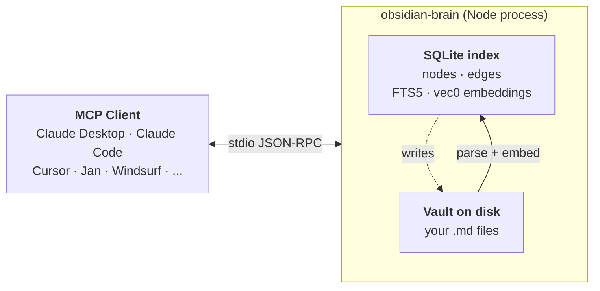

# obsidian-brain

[](https://www.npmjs.com/package/obsidian-brain)
[](LICENSE)
[](package.json)
[](https://github.com/sweir1/obsidian-brain)

A standalone Node MCP server that gives Claude (and any other MCP client) **semantic search + knowledge graph + vault editing** over an Obsidian vault. Runs as one local stdio process — no plugin, no HTTP bridge, no API key, nothing hosted. Your vault content never leaves your machine.

> 📖 **Full docs → [sweir1.github.io/obsidian-brain](https://sweir1.github.io/obsidian-brain/)**
> **Companion plugin** → [`sweir1/obsidian-brain-plugin`](https://github.com/sweir1/obsidian-brain-plugin) (optional — unlocks `active_note`, `dataview_query`, `base_query`)

**Contents** — [Why](#why-obsidian-brain) · [Quick start](#quick-start) · [What you get](#what-you-get) · [How it works](#how-it-works) · [Companion plugin](#companion-plugin-optional) · [Troubleshooting](#troubleshooting) · [Recent releases](#recent-releases)

## Why obsidian-brain?

- **Works without Obsidian running** — unlike Local REST API-based servers, obsidian-brain reads `.md` files directly from disk. Obsidian can be closed; your vault is just a folder.
- **No Local REST API plugin required** — nothing to install inside Obsidian for the core experience.
- **Chunk-level semantic search with RRF hybrid retrieval** — embeddings at markdown-heading granularity, fused with FTS5 BM25 via Reciprocal Rank Fusion. Finds the exact chunk, ranks on meaning.
- **The only Obsidian MCP server with PageRank + Louvain + graph analytics** — ask for your vault's most influential notes, bridging notes, theme clusters. Nobody else ships this.
- **Ollama provider for high-quality local embeddings** — switch to `qwen3-embedding:0.6b`, `nomic-embed-text`, `bge-m3`, etc. with one env var.
- **All in one `npx` install** — no clone, no build, no API key, no hosted endpoint. Vault content never leaves your machine.

## Quick start

### One-line install (macOS + Claude Desktop)

```bash
/bin/bash -c "$(curl -fsSL https://raw.githubusercontent.com/sweir1/obsidian-brain/main/scripts/install.sh)"
```

Installs Homebrew + Node 20+ if you don't already have them, adds the `/usr/local/bin` symlinks that Claude Desktop needs, merges obsidian-brain into your `claude_desktop_config.json`, opens the Full Disk Access pane for you to toggle Claude on, and relaunches Claude. You'll be asked for your macOS password once (for Homebrew + the symlinks) and your vault path once. Everything else is automatic. Audit what it does: [`scripts/install.sh`](scripts/install.sh).

### Manual install

Requires Node 20+ and an Obsidian vault (or any folder of `.md` files — Obsidian itself is optional).

Wire obsidian-brain into your MCP client. Example for **Claude Desktop** (`~/Library/Application Support/Claude/claude_desktop_config.json`):

```json
{
  "mcpServers": {
    "obsidian-brain": {
      "command": "npx",
      "args": ["-y", "obsidian-brain@latest", "server"],
      "env": { "VAULT_PATH": "/absolute/path/to/your/vault" }
    }
  }
}
```

Quit Claude Desktop (⌘Q on macOS) and relaunch. That's it.

> [!NOTE]
> On first boot the server auto-indexes your vault and downloads a ~34 MB embedding model. Tools may take 30–60 s to appear in the client. Subsequent boots are instant.

> [!TIP]
> **Not a developer?** The [macOS walkthrough](docs/install-mac-nontechnical.md) covers Homebrew, Node, the GUI-app PATH fix, and Full Disk Access step-by-step.

**For every other MCP client** (Claude Code, Cursor, VS Code, Jan, Windsurf, Cline, Zed, LM Studio, JetBrains AI, Opencode, Codex CLI, Gemini CLI, Warp): see [Install in your MCP client](docs/install-clients.md).

→ Full env-var reference: [Configuration](docs/configuration.md)
→ Model / preset / Ollama details: [Embedding model](docs/embeddings.md)
→ Migrating from aaronsb's plugin: [Migration guide](docs/migration-aaronsb.md)

## What you get

18 MCP tools grouped by intent:

- **Find & read** — `search`, `list_notes`, `read_note`
- **Understand the graph** — `find_connections`, `find_path_between`, `detect_themes`, `rank_notes`
- **Write** — `create_note`, `edit_note`, `apply_edit_preview`, `link_notes`, `move_note`, `delete_note`
- **Live editor** (requires [companion plugin](docs/plugin.md)) — `active_note`, `dataview_query`, `base_query`
- **Maintenance** — `reindex`, `index_status`

→ Arguments, examples, and response shapes: [Tool reference](docs/tools.md)

## How it works



Retrieval and writes both go through a SQLite index: reads are microsecond-cheap, writes land on disk immediately and incrementally re-index the affected file. Embeddings are chunk-level (heading-aware recursive chunker preserving code + LaTeX blocks), and `search`'s default `hybrid` mode fuses chunk-level semantic rank with FTS5 BM25 via Reciprocal Rank Fusion.

→ Deeper write-up — why stdio, why SQLite, why local embeddings: [Architecture](docs/architecture.md)
→ Live watcher behaviour + debounces: [Live updates](docs/watching.md)
→ Scheduled reindex (macOS launchd / Linux systemd): [Scheduled indexing (macOS)](docs/launchd.md) · [(Linux)](docs/systemd.md)

## Companion plugin (optional)

An optional Obsidian plugin at [`sweir1/obsidian-brain-plugin`](https://github.com/sweir1/obsidian-brain-plugin) exposes live Obsidian runtime state — active editor, Dataview results, Bases rows — over a localhost HTTP endpoint. When installed and Obsidian is running, `active_note`, `dataview_query`, and `base_query` light up. Install via BRAT with repo ID `sweir1/obsidian-brain-plugin`.

Ship plugin and server at the **same major.minor** — server v1.7.x pairs with plugin v1.7.x. Patch-version drift is fine.

→ Security model, capability handshake, Dataview / Bases feature coverage: [Companion plugin](docs/plugin.md)

## Troubleshooting

Four most common:

- **"Connector has no tools available"** in Claude Desktop — usually the server crashed at startup. Check `~/Library/Logs/Claude/mcp-server-obsidian-brain.log`. Fix: `npm install -g obsidian-brain@latest`, quit Claude (⌘Q), relaunch.
- **`ERR_DLOPEN_FAILED` / `NODE_MODULE_VERSION` mismatch** — `better-sqlite3` built against a different Node ABI. Fix: `PATH=/opt/homebrew/bin:$PATH npm rebuild -g better-sqlite3`.
- **`Vault path not configured`** — `VAULT_PATH` is unset. Set it in the `env` block of your client config or shell.
- **Old version loading via `npx`** (your client still shows the previous release after a publish) — stale npx cache. Fix: `rm -rf ~/.npm/_npx`, then restart your client. Keeping `@latest` in your config prevents this.

→ Full troubleshooting guide (watcher not firing, stale index, running multiple clients, timeouts, embedding-dim mismatch, log locations): [docs/troubleshooting.md](docs/troubleshooting.md)

## Recent releases

- **v1.7.5** — Bundled MTEB-driven model-metadata seed + cache-forever runtime cache; `multilingual-ollama` preset swaps to `qwen3-embedding:0.6b` (+4.77pp MTEB-multilingual gain); HF prompts fallback for instruction-aware models; `models add` / `models override` / `models fetch-seed` / `models refresh-cache` CLI subcommands; friendly `UserError` formatting; Ollama auto-detects tag swaps and reads real dim/ctx from `/api/show`.
- **v1.7.4** — `english-fast` preset model swap → `MongoDB/mdbr-leaf-ir` (Apache-2.0, retrieval-tuned 23M-param distillation of mxbai-embed-large-v1).
- **v1.7.3** — Title-fallback for empty notes + capacity-drift floor + three-bucket `index_status`.
- **v1.7.2** — Reindex bug fixes + `multilingual-ollama` auto-routing + docs split.
- **v1.7.0** — Fault-tolerant embeddings + expanded presets + BYOM CLI + `index_status` tool (one-time reindex on upgrade).

→ Full changelog: [docs/CHANGELOG.md](docs/CHANGELOG.md) · Forward plan: [docs/roadmap.md](docs/roadmap.md) · Build from source: [docs/development.md](docs/development.md)

## Credits

Thanks to [`obra/knowledge-graph`](https://github.com/obra/knowledge-graph) and [`aaronsb/obsidian-mcp-plugin`](https://github.com/aaronsb/obsidian-mcp-plugin) for the ideas and code this project draws on. Also [Xenova/transformers.js](https://github.com/xenova/transformers.js) (local embeddings), [graphology](https://graphology.github.io/) (graph analytics), and [sqlite-vec](https://github.com/asg017/sqlite-vec) (vector search in SQLite).

## License

MIT — see [LICENSE](LICENSE).
