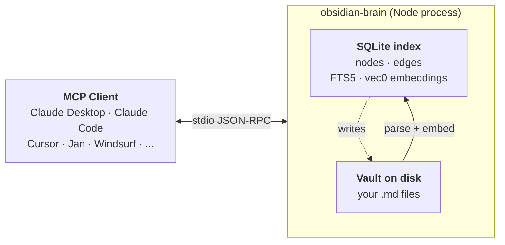

# obsidian-brain

[](https://www.npmjs.com/package/obsidian-brain)
[](LICENSE)
[](package.json)
[](https://github.com/sweir1/obsidian-brain)

A standalone Node MCP server that gives Claude (and any other MCP client) **semantic search + knowledge graph + vault editing** over an Obsidian vault. Runs as one local stdio process — no plugin, no HTTP bridge, no API key, nothing hosted. Your vault content never leaves your machine.

> 📖 **Full docs → [sweir1.github.io/obsidian-brain](https://sweir1.github.io/obsidian-brain/)**
> **Companion plugin** → [`sweir1/obsidian-brain-plugin`](https://github.com/sweir1/obsidian-brain-plugin) (optional — unlocks `active_note` + `dataview_query`)

**Contents** — [Quick start](#quick-start) · [Tool reference](#tool-reference) · [How it works](#how-it-works) · [Install in your MCP client](#install-in-your-mcp-client) · [Migrating from the aaronsb plugin](#coming-from-the-obsidian-mcp-plugin) · [Scheduled re-indexing](#scheduled-re-indexing) · [Configuration](#configuration) · [Troubleshooting](#troubleshooting) · [Development](#development--install-from-source) · [Live updates](#live-updates) · [What it doesn't do](#what-it-does-not-do-yet)

## Quick start

No clone, no build. Requires Node 20+ and an Obsidian vault (or any folder of `.md` files — Obsidian itself is optional).

Wire obsidian-brain into your MCP client. Example for **Claude Desktop** (`~/Library/Application Support/Claude/claude_desktop_config.json`):

```json
{
  "mcpServers": {
    "obsidian-brain": {
      "command": "npx",
      "args": ["-y", "obsidian-brain", "server"],
      "env": { "VAULT_PATH": "/absolute/path/to/your/vault" }
    }
  }
}
```

Quit Claude Desktop (⌘Q) and relaunch. For other clients — Claude Code, Cursor, VS Code, Jan, Cline, Zed, LM Studio, Opencode, Gemini CLI, Warp, JetBrains AI, Codex CLI, Windsurf — see [Install in your MCP client](#install-in-your-mcp-client).

> [!NOTE]
> On first boot the server **auto-indexes your vault** and downloads a ~22 MB embedding model. Tools may take 30–60 s to appear in the client. Subsequent boots are instant.

Verify from the shell (optional):

```bash
npx -y obsidian-brain --help
VAULT_PATH="$HOME/path/to/vault" npx -y obsidian-brain search "some query"
```

> [!TIP]
> Prefer a global install for faster startup and a stable binary path: `npm install -g obsidian-brain`. Then use `obsidian-brain server` directly in client configs.

## Tool reference

15 tools, grouped by intent. Each tool includes a one-line Claude prompt you can copy-paste to nudge routing in the right direction. Tools marked *requires companion plugin* only work when the [companion Obsidian plugin](docs/plugin.md) is installed and Obsidian is running.

> [!TIP]
> Since v1.2.2, `edit_note` with `mode: 'patch_heading'` supports `scope: 'body'` to stop at the first blank line (prevents the default `'section'` scope from consuming content below a trailing heading). `patch_frontmatter` accepts `valueJson` for clients like claude.ai that stringify tool-call params — pass `valueJson: 'null'` to clear a key, `valueJson: 'true'` for a real boolean, `valueJson: '42'` for a number. `create_note` respects `frontmatter: { title: null }` as opt-out from title auto-injection. `list_notes` gains `includeStubs: false` to filter out unresolved wiki-link targets.

> [!TIP]
> **v1.3.0 adds `dataview_query`** (requires companion plugin v0.2.0+ and the Dataview community plugin enabled). Returns a normalized `{kind, ...}` discriminated union — Dataview's `Link`/`DateTime`/`DataArray`/`Duration` values are flattened to JSON so tools consuming the output don't need Dataview runtime types. `timeoutMs` only bounds the HTTP wait; Dataview itself has no cancellation API, so prefer `LIMIT N` for open-ended queries. Plugin ≥ 0.2.0 also writes a `capabilities` list in its discovery file so future tools can fail fast with an upgrade prompt when connected to an older plugin.

### Find stuff

- **`search`** — Find notes by meaning (semantic) or by exact text (full-text).
  > *"Use `search` to find notes semantically about supply-chain tax."*
- **`list_notes`** — List notes, optionally filtered by directory or tag.
  > *"Use `list_notes` to list every note under `Projects/` tagged `#active`."*
- **`read_note`** — Read a note's metadata (and optionally full body). Fuzzy-matches filenames.
  > *"Use `read_note` to open the note called 'Q4 planning' and include the full content."*

### Understand the graph

- **`find_connections`** — N-hop link neighborhood around a note. Optional full subgraph.
  > *"Use `find_connections` to show everything within 2 hops of `Epistemology.md`."*
- **`find_path_between`** — Shortest link chain(s) between two notes. Optional shared-neighbors.
  > *"Use `find_path_between` to find how `Bayesian updating` connects to `Kelly criterion`."*
- **`detect_themes`** — Auto-detected topic clusters via Louvain community detection.
  > *"Use `detect_themes` to surface the main themes across my vault."*
- **`rank_notes`** — Top notes by influence (PageRank) or bridging (betweenness centrality).
  > *"Use `rank_notes` to list the top 10 most-linked-to notes by PageRank."*

### Write stuff

- **`create_note`** — Create a new note with frontmatter and auto-index it.
  > *"Use `create_note` to create `Meetings/2026-04-21 standup.md` with tags `[meeting, standup]`."*
- **`edit_note`** — Modify an existing note: append / prepend / window / patch-heading / patch-frontmatter / at-line.
  > *"Use `edit_note` to append a 'Follow-ups' section to today's standup note."*
- **`link_notes`** — Add a wiki-link between two notes plus a "why this connects" context sentence.
  > *"Use `link_notes` to link `Bayesian updating` to `Kelly criterion` with a note about risk-adjusted bets."*
- **`move_note`** — Rename or move a note; edges stay intact.
  > *"Use `move_note` to move `Inbox/thought.md` into `Areas/Ideas/thought.md`."*
- **`delete_note`** — Delete a note; requires `confirm: true`.
  > *"Use `delete_note` with `confirm: true` to delete `Inbox/obsolete.md`."*

### Live editor (requires [companion plugin](docs/plugin.md))

- **`active_note`** — Returns the note currently open in Obsidian + cursor position + selection. Requires the [`obsidian-brain-plugin`](https://github.com/sweir1/obsidian-brain-plugin) companion installed in your vault and Obsidian running.
  > *"Use `active_note` to see what note I'm editing right now."*
- **`dataview_query`** *(v1.3.0)* — Run a Dataview DQL query. Returns a normalized discriminated union: `kind='table'` gives `{headers, rows}`, `'list'` gives `{values}`, `'task'` gives `{items: [...]}` with full STask fields, `'calendar'` gives `{events: [...]}`. All Dataview `Link`/`DateTime`/`DataArray`/`Duration` values are flattened to JSON. Requires companion plugin v0.2.0+ and the Dataview community plugin enabled in the vault. 30s default timeout — see [docs/plugin.md](docs/plugin.md#dataview) for the timeout caveat (Dataview has no cancellation API).
  > *"Use `dataview_query` to list every note tagged #book with its rating."*

### Maintenance

- **`reindex`** — Force a full re-index. You rarely need this — the watcher picks up file changes automatically; fall back to this if your vault lives somewhere FSEvents/inotify can't observe. Since v1.2.2, passing `resolution` or detecting any deletion forces a fresh Louvain community pass (previously these could silently no-op).
  > *"Use `reindex` to refresh the index after I bulk-edited files outside Claude."*

## How it works



Retrieval and writes both go through the SQLite index: reads are microsecond-cheap, writes land on disk immediately and incrementally re-index the affected file. Embeddings use [Xenova's local port of all-MiniLM-L6-v2](https://huggingface.co/Xenova/all-MiniLM-L6-v2) — 384 dims, ~22 MB, fully local, no API calls.

> [!TIP]
> Why stdio, why SQLite, why incremental mtime sync: see [docs/architecture.md](docs/architecture.md).

## Install in your MCP client

obsidian-brain is a **local, stdio-only** MCP server. No API key. No hosted endpoint. No remote URL. Your vault content never leaves your machine. Every snippet below runs the same process locally and differs only in how your client expects the config to be shaped. Replace `/absolute/path/to/your/vault` everywhere with the real path to your vault.

On first boot the server auto-indexes the vault and downloads the ~22 MB embedding model — initial `tools/list` may block for 30–60 s, subsequent starts are instant.

No system-level prerequisites beyond Node 20+. `npm install` bundles every native binding — `better-sqlite3` (with its own statically-linked SQLite build), the `sqlite-vec` extension, and the ONNX runtime for local embeddings — as prebuilt binaries for macOS, Linux, and Windows. You don't need `brew install sqlite`, Xcode Command Line Tools, or Python unless you land in the rare case where no prebuilt matches your Node version (see [Troubleshooting → ERR_DLOPEN_FAILED](docs/troubleshooting.md#err_dlopen_failed-node_module_version-mismatch)).

<details>
<summary><strong>Claude Desktop</strong></summary>

<p></p>

Open the config file (create it if missing):

- macOS: `~/Library/Application Support/Claude/claude_desktop_config.json`
- Windows: `%APPDATA%\Claude\claude_desktop_config.json`

Or from the app: **Settings → Developer → Edit Config**. Add under `mcpServers`:

```json
{
  "mcpServers": {
    "obsidian-brain": {
      "command": "npx",
      "args": ["-y", "obsidian-brain", "server"],
      "env": { "VAULT_PATH": "/absolute/path/to/your/vault" }
    }
  }
}
```

Fully quit Claude Desktop (⌘Q on macOS) and relaunch. If it can't find `npx`, swap for the absolute path (`/opt/homebrew/bin/npx` on macOS Homebrew). [Claude Desktop MCP quickstart](https://modelcontextprotocol.io/quickstart/user).

</details>

<details>
<summary><strong>Claude Code</strong></summary>

<p></p>

```bash
claude mcp add --scope user --transport stdio obsidian-brain \
  -e VAULT_PATH="$HOME/path/to/your/vault" \
  -- npx -y obsidian-brain server
```

All flags (`--scope`, `--transport`, `-e`) come before the server name. `--` separates the name from the launch command. To raise the startup timeout for the first-boot auto-index, prefix the `claude` CLI with `MCP_TIMEOUT=60000`. [Claude Code MCP docs](https://code.claude.com/docs/en/mcp).

</details>

<details>
<summary><strong>Cursor</strong></summary>

<p></p>

Fastest: **Cursor Settings → MCP → Add new MCP server**. Or edit `~/.cursor/mcp.json` (global) / `.cursor/mcp.json` (project):

```json
{
  "mcpServers": {
    "obsidian-brain": {
      "command": "npx",
      "args": ["-y", "obsidian-brain", "server"],
      "env": { "VAULT_PATH": "/absolute/path/to/your/vault" }
    }
  }
}
```

Reload Cursor; the server appears under Settings → MCP with its 15 tools. [Cursor MCP docs](https://cursor.com/docs/context/mcp).

</details>

<details>
<summary><strong>VS Code (GitHub Copilot)</strong></summary>

<p></p>

VS Code 1.102+ with Copilot. CLI:

```bash
code --add-mcp '{"name":"obsidian-brain","command":"npx","args":["-y","obsidian-brain","server"],"env":{"VAULT_PATH":"/absolute/path/to/your/vault"}}'
```

Or create `.vscode/mcp.json` in your workspace (note: top-level key is `servers`, with `type: "stdio"`):

```json
{
  "servers": {
    "obsidian-brain": {
      "type": "stdio",
      "command": "npx",
      "args": ["-y", "obsidian-brain", "server"],
      "env": { "VAULT_PATH": "/absolute/path/to/your/vault" }
    }
  }
}
```

Open Copilot Chat in **Agent** mode. [VS Code MCP docs](https://code.visualstudio.com/docs/copilot/customization/mcp-servers).

</details>

<details>
<summary><strong>Windsurf</strong></summary>

<p></p>

Cascade → **MCP** icon (top right) → **Manage MCPs** → **View raw config**, or edit `~/.codeium/windsurf/mcp_config.json`:

```json
{
  "mcpServers": {
    "obsidian-brain": {
      "command": "npx",
      "args": ["-y", "obsidian-brain", "server"],
      "env": { "VAULT_PATH": "/absolute/path/to/your/vault" }
    }
  }
}
```

Click **Refresh** in the MCP panel (no full Windsurf restart needed). [Windsurf MCP docs](https://docs.windsurf.com/windsurf/cascade/mcp).

</details>

<details>
<summary><strong>Jan</strong></summary>

<p></p>

**Settings → MCP Servers → + Add**. Transport: `STDIO (local process)`. Command: `npx` (or absolute path if Jan can't find it). Arguments: `-y`, `obsidian-brain`, `server`. Env: `VAULT_PATH=/absolute/path/to/your/vault`. Save and toggle on.

Equivalent JSON (Jan writes this itself under `~/Library/Application Support/Jan/data/mcp_config.json` on macOS, `~/.config/Jan/data/mcp_config.json` on Linux, `%APPDATA%\Jan\data\mcp_config.json` on Windows):

```json
{
  "mcpServers": {
    "obsidian-brain": {
      "command": "npx",
      "args": ["-y", "obsidian-brain", "server"],
      "env": { "VAULT_PATH": "/absolute/path/to/your/vault" }
    }
  }
}
```

**Use STDIO, not HTTP.** Jan 0.7.x's rmcp client has an open bug with Streamable-HTTP that kills `tools/list` right after `initialize` ([rust-sdk#468](https://github.com/modelcontextprotocol/rust-sdk/issues/468)). obsidian-brain is stdio-only anyway, but don't wrap it in an HTTP proxy for Jan or you'll trip the bug. Full walkthrough: [docs/jan.md](docs/jan.md).

</details>

<details>
<summary><strong>Cline</strong></summary>

<p></p>

Click the MCP Servers icon in Cline's nav bar → **Installed** → **Configure MCP Servers** to open `cline_mcp_settings.json`. Paste:

```json
{
  "mcpServers": {
    "obsidian-brain": {
      "command": "npx",
      "args": ["-y", "obsidian-brain", "server"],
      "env": { "VAULT_PATH": "/absolute/path/to/your/vault" },
      "disabled": false,
      "autoApprove": []
    }
  }
}
```

On Windows, swap to `"command": "cmd"`, `"args": ["/c", "npx", "-y", "obsidian-brain", "server"]` so `npx.cmd` is resolved. [Cline MCP docs](https://docs.cline.bot/mcp/configuring-mcp-servers).

</details>

<details>
<summary><strong>Zed</strong></summary>

<p></p>

Agent Panel → settings gear → **Add Custom Server**, or edit `~/.config/zed/settings.json` directly (`%APPDATA%\Zed\settings.json` on Windows). Zed uses `context_servers` with `"source": "custom"`:

```json
{
  "context_servers": {
    "obsidian-brain": {
      "source": "custom",
      "command": "npx",
      "args": ["-y", "obsidian-brain", "server"],
      "env": { "VAULT_PATH": "/absolute/path/to/your/vault" }
    }
  }
}
```

A green dot next to the server in the Agent Panel means it's live. [Zed MCP docs](https://zed.dev/docs/ai/mcp).

</details>

<details>
<summary><strong>LM Studio</strong></summary>

<p></p>

Right sidebar → **Program** tab → **Install** → **Edit mcp.json** (`~/.lmstudio/mcp.json` on macOS/Linux, `%USERPROFILE%\.lmstudio\mcp.json` on Windows):

```json
{
  "mcpServers": {
    "obsidian-brain": {
      "command": "npx",
      "args": ["-y", "obsidian-brain", "server"],
      "env": { "VAULT_PATH": "/absolute/path/to/your/vault" }
    }
  }
}
```

LM Studio spawns the server automatically on save. [LM Studio MCP docs](https://lmstudio.ai/docs/app/plugins/mcp).

</details>

<details>
<summary><strong>JetBrains AI Assistant</strong></summary>

<p></p>

IntelliJ / PyCharm / WebStorm 2025.1+ with AI Assistant 251.26094.80.5+. **Settings → Tools → AI Assistant → Model Context Protocol (MCP) → Add → As JSON**:

```json
{
  "mcpServers": {
    "obsidian-brain": {
      "command": "npx",
      "args": ["-y", "obsidian-brain", "server"],
      "env": { "VAULT_PATH": "/absolute/path/to/your/vault" }
    }
  }
}
```

Pick Global or Project scope, enable the row; the Status column turns green when the stdio subprocess is live. [JetBrains MCP docs](https://www.jetbrains.com/help/ai-assistant/configure-an-mcp-server.html).

</details>

<details>
<summary><strong>Opencode</strong></summary>

<p></p>

Add to `opencode.json` (project root) or `~/.config/opencode/opencode.json` (global). Note the shape: top-level `mcp`, `type: "local"`, `command` is an array, env lives under `environment`:

```json
{
  "$schema": "https://opencode.ai/config.json",
  "mcp": {
    "obsidian-brain": {
      "type": "local",
      "command": ["npx", "-y", "obsidian-brain", "server"],
      "enabled": true,
      "environment": { "VAULT_PATH": "/absolute/path/to/your/vault" }
    }
  }
}
```

[Opencode MCP docs](https://opencode.ai/docs/mcp-servers).

</details>

<details>
<summary><strong>OpenAI Codex CLI</strong></summary>

<p></p>

```bash
codex mcp add obsidian-brain --env VAULT_PATH="$HOME/path/to/your/vault" -- npx -y obsidian-brain server
```

Then bump the startup timeout in `~/.codex/config.toml` — the default 10 s is too short for first-boot auto-indexing:

```toml
[mcp_servers.obsidian-brain]
command = "npx"
args = ["-y", "obsidian-brain", "server"]
startup_timeout_sec = 60

[mcp_servers.obsidian-brain.env]
VAULT_PATH = "/absolute/path/to/your/vault"
```

[Codex MCP docs](https://developers.openai.com/codex/mcp).

</details>

<details>
<summary><strong>Gemini CLI</strong></summary>

<p></p>

No `mcp add` subcommand — edit `~/.gemini/settings.json` and merge into `mcpServers`:

```json
{
  "mcpServers": {
    "obsidian-brain": {
      "command": "npx",
      "args": ["-y", "obsidian-brain", "server"],
      "env": { "VAULT_PATH": "$HOME/path/to/your/vault" },
      "timeout": 60000
    }
  }
}
```

Gemini expands `$VAR` inside the `env` block; `timeout` is in milliseconds. [Gemini CLI MCP docs](https://www.geminicli.com/docs/tools/mcp-server).

</details>

<details>
<summary><strong>Warp</strong></summary>

<p></p>

**Settings → AI → Manage MCP servers → + Add → CLI Server (Command)**. Paste:

```json
{
  "obsidian-brain": {
    "command": "npx",
    "args": ["-y", "obsidian-brain", "server"],
    "env": { "VAULT_PATH": "/absolute/path/to/your/vault" },
    "working_directory": null
  }
}
```

Warp launches the command on startup and shuts it down on exit. [Warp MCP docs](https://docs.warp.dev/agent-platform/warp-agents/agent-context/mcp).

</details>

<details>
<summary><strong>Other clients</strong></summary>

<p></p>

The common shape across almost every client is:

```json
{
  "command": "npx",
  "args": ["-y", "obsidian-brain", "server"],
  "env": { "VAULT_PATH": "/absolute/path/to/your/vault" }
}
```

Wrap it in whatever top-level key your client expects (`mcpServers`, `servers`, `mcp`, `context_servers`, etc.). No API key, no remote URL, no auth header — none of that applies to a local stdio server.

On Windows, if `npx` isn't found, swap `"command": "npx"` for `"command": "cmd"` and prepend `/c` to the args: `["/c", "npx", "-y", "obsidian-brain", "server"]`.

</details>

## Coming from the Obsidian MCP plugin?

If you were using [`aaronsb/obsidian-mcp-plugin`](https://github.com/aaronsb/obsidian-mcp-plugin) as your Claude connector:

1. Remove its block from your client config and add obsidian-brain's ([Install in your MCP client](#install-in-your-mcp-client)).
2. Disable the plugin in Obsidian (Settings → Community plugins → toggle off). Uninstall BRAT too if you don't beta-test other plugins.
3. Quit Claude Desktop (⌘Q) and relaunch.

You can uninstall the aaronsb plugin entirely. We're building equivalent Dataview + Bases support into our own optional [companion plugin](docs/plugin.md) — `active_note` (v1.2.0) and `dataview_query` (v1.3.0) are live; `base_query` arrives in v1.4.0. Inline Dataview `key:: value` fields are parsed into searchable frontmatter with or without the plugin.

## Scheduled re-indexing

> [!NOTE]
> Since v1.1 the live watcher (see [Live updates](#live-updates)) is the default, so most users don't need this section. Keep reading if you run `OBSIDIAN_BRAIN_NO_WATCH=1`, your vault lives on a network share where FSEvents/inotify don't fire, or you want a dedicated daemon independent of any MCP client.

The scheduled-index fallback: a periodic CLI run (`obsidian-brain index`) keeps the index fresh. Incremental, mtime-based, cheap after the first run.

- **macOS (LaunchAgent)** — see [docs/launchd.md](docs/launchd.md) for the plist template + load/unload flow.
- **Linux (systemd user service or timer)** — see [docs/systemd.md](docs/systemd.md). A `watch` service is the recommended dedicated-daemon setup; the timer is the fallback when the watcher can't observe your filesystem.
- **Windows** — Task Scheduler; run `obsidian-brain index` every 30 min with `VAULT_PATH` set.

Or skip it and call the `reindex` tool from chat when you want a refresh.

## Configuration

All config is via environment variables:

| Variable | Required? | Default | Description |
|---|---|---|---|
| `VAULT_PATH` | **yes** | — | Absolute path to the vault (folder of `.md` files). |
| `DATA_DIR` | no | `$XDG_DATA_HOME/obsidian-brain` or `$HOME/.local/share/obsidian-brain` | Where the SQLite index + embedding cache live. |
| `EMBEDDING_MODEL` | no | `Xenova/all-MiniLM-L6-v2` | Hugging Face transformers-js sentence-embedding model. See [Embedding model](#embedding-model) for alternatives. **Auto-reindex**: switching models is safe — the server stores the active model identifier + dim in the DB and rebuilds per-chunk vectors the next time it boots under a new identifier. No `--drop` required. |
| `OBSIDIAN_BRAIN_NO_WATCH` | no | unset | Set to `1` to disable the auto-watcher in `server` and fall back to scheduled re-indexing. |
| `OBSIDIAN_BRAIN_NO_CATCHUP` | no | unset | Set to `1` to disable the startup catchup reindex that picks up edits made while the server was down. |
| `OBSIDIAN_BRAIN_WATCH_DEBOUNCE_MS` | no | `3000` | Per-file reindex debounce for the watcher. |
| `OBSIDIAN_BRAIN_COMMUNITY_DEBOUNCE_MS` | no | `60000` | Graph-wide community-detection debounce for the watcher. |
| `OBSIDIAN_BRAIN_TOOL_TIMEOUT_MS` | no | `30000` | Per-tool-call timeout (ms). If a handler runs longer, the server returns an MCP error pointing at the log path instead of hanging. |

`KG_VAULT_PATH` is accepted as a legacy alias for `VAULT_PATH`.

## Embedding model

As of v1.4.0 the embedder is pluggable. Set `EMBEDDING_MODEL` to any
transformers.js-compatible sentence-embedding checkpoint. The server records
the active model (and its output dim) in the index. If you switch models the
next startup detects the change, drops the old vectors, and rebuilds per-chunk
embeddings against the new model — no manual `--drop` required.

| Model | Dim | Size | Notes |
|---|---|---|---|
| `Xenova/all-MiniLM-L6-v2` | 384 | ~22 MB | **Default.** Fast, small, solid baseline. |
| `Xenova/bge-small-en-v1.5` | 384 | ~33 MB | Noticeably better retrieval at the same dim. |
| `Xenova/bge-base-en-v1.5` | 768 | ~110 MB | Best quality on CPU. Slower embed, larger index. |
| `Xenova/paraphrase-multilingual-MiniLM-L12-v2` | 384 | ~120 MB | Non-English vaults. |

Since v1.4.0 embeddings are **chunk-level** — each note is split at markdown
headings (H1–H4) and oversized sections are further split on paragraph /
sentence boundaries, preserving code fences and `$$…$$` LaTeX blocks. The
default `hybrid` search mode fuses chunk-level semantic rank and full-text
BM25 rank via Reciprocal Rank Fusion (RRF), so you get both literal-token
hits and concept matches out of the box.

## Troubleshooting

Common issues below. Long-form walkthrough with more edge cases: [docs/troubleshooting.md](docs/troubleshooting.md).

- **"Connector has no tools available"** in Claude Desktop — usually means the server crashed at startup. Check `~/Library/Logs/Claude/mcp-server-obsidian-brain.log`. For the npm install: `npm install -g obsidian-brain@latest` to grab a fresh build, then ⌘Q and relaunch Claude Desktop. For a source clone: `npm run build` from the repo then relaunch.
- **`ERR_DLOPEN_FAILED` or `NODE_MODULE_VERSION` mismatch** — `better-sqlite3` was built against a different Node ABI than the one running the server. Rebuild the native module:
  ```bash
  # npm-installed:
  PATH=/opt/homebrew/bin:$PATH npm rebuild -g better-sqlite3
  # source clone:
  PATH=/opt/homebrew/bin:$PATH npm rebuild better-sqlite3
  ```
- **Slow first run** — the 22 MB `all-MiniLM-L6-v2` embedding model downloads on first use and caches under `DATA_DIR`. The server also auto-indexes the full vault on first boot. Subsequent boots are fast.
- **`Vault path not configured`** — `VAULT_PATH` isn't set. Set it in the `env` block of your Claude Desktop / Claude Code / Jan config, or export it in your shell. `KG_VAULT_PATH` is accepted as a legacy alias.
- **Index stale after a manual edit outside Claude** — the `server` watcher normally picks up file changes within a few seconds. If it's not firing (vault on SMB/NFS, `OBSIDIAN_BRAIN_NO_WATCH=1` set somewhere, etc.) see [docs/troubleshooting.md → Watcher not firing](docs/troubleshooting.md#watcher-not-firing). To force an immediate refresh: call the `reindex` MCP tool from your client or run `VAULT_PATH=... obsidian-brain index`.
- **Tool call hangs for minutes then "No result received" in Claude Desktop** — almost always a client-side stdio transport stall, not a server hang. Since v1.2.1 the server has its own 30s timeout that returns an actionable error. See [docs/troubleshooting.md → Tool calls hang for 4 minutes](docs/troubleshooting.md#tool-calls-hang-for-4-minutes-then-time-out-client-side) for how to tell which side the hang was on via the log, and [Collecting MCP server logs](docs/troubleshooting.md#collecting-mcp-server-logs) for the path.
- **Running two MCP clients against the same vault** — fine since v1.2.1 (SQLite WAL + `busy_timeout = 5000`), with minor inefficiencies. Details at [docs/troubleshooting.md → Running multiple MCP clients](docs/troubleshooting.md#running-multiple-mcp-clients-against-the-same-vault).

## Development / install from source

You only need this path if you want to modify the server. Normal users should install from npm per [Quick start](#quick-start).

```bash
git clone https://github.com/sweir1/obsidian-brain.git
cd obsidian-brain
npm install
npm run build
VAULT_PATH="$HOME/path/to/vault" node dist/cli/index.js server
```

Point your MCP client at `/absolute/path/to/obsidian-brain/dist/cli/index.js` with arg `server` if you want to test a local build.

Repo layout (key directories under `src/`):

```
obsidian-brain/
├── src/
│   ├── server.ts              # MCP server bootstrap
│   ├── cli/index.ts           # `obsidian-brain` CLI
│   ├── config.ts              # env parsing
│   ├── tools/                 # one file per MCP tool
│   ├── store/                 # SQLite schema + CRUD
│   ├── embeddings/            # Xenova model wrapper
│   ├── graph/                 # graphology + analytics
│   ├── vault/                 # read/write/edit .md files
│   ├── search/                # semantic + FTS
│   ├── resolve/               # fuzzy note-name matching
│   └── pipeline/              # indexing orchestrator
├── test/                      # vitest
├── scripts/                   # smoke tests + dev helpers
└── dist/                      # tsc output (gitignored)
```

Every source file targets <200 lines and has a single concern.

Common commands:

| Command | What it does |
|---|---|
| `npm run build` | Compile TypeScript to `dist/`. |
| `npm test` | Run vitest unit tests. |
| `npm run smoke` | End-to-end MCP smoke test against a throwaway temp vault. |
| `npm run dev` | Run the server directly via `tsx` (no build step — handy for iteration). |

## Live updates

`obsidian-brain server` watches your vault and reindexes on file changes — no cron, no timer, no manual re-runs. Under the hood: chokidar (FSEvents on macOS, inotify on Linux) with a 3-second per-file debounce so Obsidian's ~2s autosave bursts collapse into a single reindex per editing pause. Community detection (Louvain over the whole graph) runs on a separate 60-second debounce — the only genuinely expensive operation stays batched.

On server startup, if the index is non-empty, an incremental catchup reindex runs in the background so any edits you made while the MCP client was closed land in the index within a few seconds of relaunch. The catchup is mtime-based and doesn't block `tools/list`, so Claude sees its tools immediately while the catchup finishes in parallel.

Knobs, if you want them:

| Env var | Default | Effect |
|---|---|---|
| `OBSIDIAN_BRAIN_NO_WATCH` | unset | Set to `1` to disable the auto-watcher and fall back to the scheduled-index model (`obsidian-brain index` via launchd/systemd). |
| `OBSIDIAN_BRAIN_NO_CATCHUP` | unset | Set to `1` to disable the startup catchup reindex. |
| `OBSIDIAN_BRAIN_WATCH_DEBOUNCE_MS` | `3000` | Per-file reindex debounce. |
| `OBSIDIAN_BRAIN_COMMUNITY_DEBOUNCE_MS` | `60000` | Graph-wide community detection debounce. |

If you don't run an MCP client continuously, there's also `obsidian-brain watch` as a standalone long-running command — point a launchd agent or systemd user service at it and the index stays live without any MCP client involvement.

Deeper write-up: [docs/watching.md](docs/watching.md).

## Companion plugin (optional)

Three kinds of data only exist inside a running Obsidian process: Dataview DQL results, Obsidian Bases rows, and active-editor state. To reach them we ship an **optional** Obsidian plugin at [`sweir1/obsidian-brain-plugin`](https://github.com/sweir1/obsidian-brain-plugin) that exposes a localhost-only HTTP endpoint the server connects to. Install it via BRAT with the repo ID `sweir1/obsidian-brain-plugin`.

When the plugin is installed and Obsidian is open, `active_note` (v1.2.0) and `dataview_query` (v1.3.0) light up. `base_query` arrives in v1.4.0. Every other tool keeps working with or without the plugin.

Details, security model, troubleshooting: [`docs/plugin.md`](docs/plugin.md).

## What it does *not* do (yet)

| Gap | Why | Workaround / future |
|---|---|---|
| **Dataview DQL queries** | DQL is evaluated inside Obsidian against Dataview's own in-memory index — we can't replicate that from outside. | **Shipped** in v1.3.0 as `dataview_query` via the [companion plugin](docs/plugin.md) (requires the Dataview community plugin enabled). Inline `key:: value` fields are still parsed into searchable frontmatter without any plugin. |
| **Obsidian Bases** | Bases view rows are computed by Obsidian against its metadata cache. | Arrives in v1.4.0 via the [companion plugin](docs/plugin.md). |
| **Live-workspace / active-editor awareness** | Requires a signal from inside Obsidian. | **Shipped** in v1.2.0 as `active_note` via the [companion plugin](docs/plugin.md). |
| **Cloud embeddings (OpenAI / Voyage / Cohere)** | Deliberate: fully local, zero API calls, zero egress, works offline. | If you want cloud embeddings, the `Embedder` class is easy to fork — but it's not a config knob. |

Full forward-looking plan: [`docs/roadmap.md`](docs/roadmap.md) — v1.4.0 Bases, v1.5.0 deferred UX bundle, plugin v0.3.0 pairing, and explicit "not planned" stances.

## Credits

Thanks to [`obra/knowledge-graph`](https://github.com/obra/knowledge-graph) and [`aaronsb/obsidian-mcp-plugin`](https://github.com/aaronsb/obsidian-mcp-plugin) for the ideas and code this project draws on. Also [Xenova/transformers.js](https://github.com/xenova/transformers.js) (local embeddings), [graphology](https://graphology.github.io/) (graph analytics), and [sqlite-vec](https://github.com/asg017/sqlite-vec) (vector search in SQLite).

## License

MIT — see [LICENSE](LICENSE).
