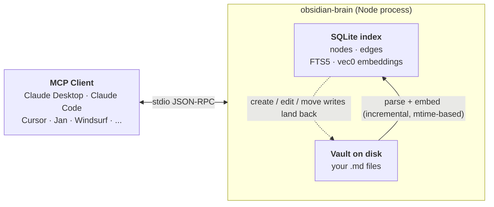

# obsidian-brain

[](https://www.npmjs.com/package/obsidian-brain)
[](LICENSE)
[](package.json)
[](https://github.com/sweir1/obsidian-brain)

A standalone Node MCP server that gives Claude (and any other MCP client) **semantic search + knowledge graph + vault editing** over an Obsidian vault. Runs as one local stdio process — no plugin, no HTTP bridge, no API key, nothing hosted. Your vault content never leaves your machine.

**Contents** — [Quick start](#quick-start) · [Tool reference](#tool-reference) · [How it works](#how-it-works) · [Install in your MCP client](#install-in-your-mcp-client) · [Configuration](#configuration) · [Scheduled re-indexing](#scheduled-re-indexing) · [Troubleshooting](#troubleshooting) · [Migrating from the aaronsb plugin](#coming-from-the-obsidian-mcp-plugin) · [Development](#development--install-from-source)

## Quick start

No clone, no build. Requires Node 20+ and an Obsidian vault (or any folder of `.md` files — Obsidian itself is optional).

Wire obsidian-brain into your MCP client. Example for **Claude Desktop** (`~/Library/Application Support/Claude/claude_desktop_config.json`):

```json
{
  "mcpServers": {
    "obsidian-brain": {
      "command": "npx",
      "args": ["-y", "obsidian-brain", "server"],
      "env": { "VAULT_PATH": "/absolute/path/to/your/vault" }
    }
  }
}
```

Quit Claude Desktop (⌘Q) and relaunch. For other clients — Claude Code, Cursor, VS Code, Jan, Cline, Zed, LM Studio, Opencode, Gemini CLI, Warp, JetBrains AI, Codex CLI, Windsurf — see [Install in your MCP client](#install-in-your-mcp-client).

> [!NOTE]
> On first boot the server **auto-indexes your vault** and downloads a ~22 MB embedding model. Tools may take 30–60 s to appear in the client. Subsequent boots are instant.

Verify from the shell (optional):

```bash
npx -y obsidian-brain --help
VAULT_PATH="$HOME/path/to/vault" npx -y obsidian-brain search "some query"
```

> [!TIP]
> Prefer a global install for faster startup and a stable binary path: `npm install -g obsidian-brain`. Then use `obsidian-brain server` directly in client configs.

## Tool reference

13 tools, grouped by intent. Each tool includes a one-line Claude prompt you can copy-paste to nudge routing in the right direction.

### Find stuff

- **`search`** — Find notes by meaning (semantic) or by exact text (full-text).
  > *"Use `search` to find notes semantically about supply-chain tax."*
- **`list_notes`** — List notes, optionally filtered by directory or tag.
  > *"Use `list_notes` to list every note under `Projects/` tagged `#active`."*
- **`read_note`** — Read a note's metadata (and optionally full body). Fuzzy-matches filenames.
  > *"Use `read_note` to open the note called 'Q4 planning' and include the full content."*

### Understand the graph

- **`find_connections`** — N-hop link neighborhood around a note. Optional full subgraph.
  > *"Use `find_connections` to show everything within 2 hops of `Epistemology.md`."*
- **`find_path_between`** — Shortest link chain(s) between two notes. Optional shared-neighbors.
  > *"Use `find_path_between` to find how `Bayesian updating` connects to `Kelly criterion`."*
- **`detect_themes`** — Auto-detected topic clusters via Louvain community detection.
  > *"Use `detect_themes` to surface the main themes across my vault."*
- **`rank_notes`** — Top notes by influence (PageRank) or bridging (betweenness centrality).
  > *"Use `rank_notes` to list the top 10 most-linked-to notes by PageRank."*

### Write stuff

- **`create_note`** — Create a new note with frontmatter and auto-index it.
  > *"Use `create_note` to create `Meetings/2026-04-21 standup.md` with tags `[meeting, standup]`."*
- **`edit_note`** — Modify an existing note: append / prepend / window / patch-heading / patch-frontmatter / at-line.
  > *"Use `edit_note` to append a 'Follow-ups' section to today's standup note."*
- **`link_notes`** — Add a wiki-link between two notes plus a "why this connects" context sentence.
  > *"Use `link_notes` to link `Bayesian updating` to `Kelly criterion` with a note about risk-adjusted bets."*
- **`move_note`** — Rename or move a note; edges stay intact.
  > *"Use `move_note` to move `Inbox/thought.md` into `Areas/Ideas/thought.md`."*
- **`delete_note`** — Delete a note; requires `confirm: true`.
  > *"Use `delete_note` with `confirm: true` to delete `Inbox/obsolete.md`."*

### Maintenance

- **`reindex`** — Force a full re-index. Normally auto-run on a launchd/systemd timer.
  > *"Use `reindex` to refresh the index after I bulk-edited files outside Claude."*

## How it works



Retrieval and writes both go through the SQLite index: reads are microsecond-cheap, writes land on disk immediately and incrementally re-index the affected file. Embeddings use [Xenova's local port of all-MiniLM-L6-v2](https://huggingface.co/Xenova/all-MiniLM-L6-v2) — 384 dims, ~22 MB, fully local, no API calls.

> [!TIP]
> Why stdio, why SQLite, why incremental mtime sync: see [docs/architecture.md](docs/architecture.md).

## Install in your MCP client

obsidian-brain is a **local, stdio-only** MCP server. No API key. No hosted endpoint. No remote URL. Your vault content never leaves your machine. Every snippet below runs the same process locally and differs only in how your client expects the config to be shaped. Replace `/absolute/path/to/your/vault` everywhere with the real path to your vault.

On first boot the server auto-indexes the vault and downloads the ~22 MB embedding model — initial `tools/list` may block for 30–60 s, subsequent starts are instant.

<details>
<summary><strong>Claude Desktop</strong></summary>

<p></p>

Open the config file (create it if missing):

- macOS: `~/Library/Application Support/Claude/claude_desktop_config.json`
- Windows: `%APPDATA%\Claude\claude_desktop_config.json`

Or from the app: **Settings → Developer → Edit Config**. Add under `mcpServers`:

```json
{
  "mcpServers": {
    "obsidian-brain": {
      "command": "npx",
      "args": ["-y", "obsidian-brain", "server"],
      "env": { "VAULT_PATH": "/absolute/path/to/your/vault" }
    }
  }
}
```

Fully quit Claude Desktop (⌘Q on macOS) and relaunch. If it can't find `npx`, swap for the absolute path (`/opt/homebrew/bin/npx` on macOS Homebrew). [Claude Desktop MCP quickstart](https://modelcontextprotocol.io/quickstart/user).

</details>

<details>
<summary><strong>Claude Code</strong></summary>

<p></p>

```bash
claude mcp add --scope user --transport stdio obsidian-brain \
  -e VAULT_PATH="$HOME/path/to/your/vault" \
  -- npx -y obsidian-brain server
```

All flags (`--scope`, `--transport`, `-e`) come before the server name. `--` separates the name from the launch command. To raise the startup timeout for the first-boot auto-index, prefix the `claude` CLI with `MCP_TIMEOUT=60000`. [Claude Code MCP docs](https://code.claude.com/docs/en/mcp).

</details>

<details>
<summary><strong>Cursor</strong></summary>

<p></p>

Fastest: **Cursor Settings → MCP → Add new MCP server**. Or edit `~/.cursor/mcp.json` (global) / `.cursor/mcp.json` (project):

```json
{
  "mcpServers": {
    "obsidian-brain": {
      "command": "npx",
      "args": ["-y", "obsidian-brain", "server"],
      "env": { "VAULT_PATH": "/absolute/path/to/your/vault" }
    }
  }
}
```

Reload Cursor; the server appears under Settings → MCP with its 13 tools. [Cursor MCP docs](https://cursor.com/docs/context/mcp).

</details>

<details>
<summary><strong>VS Code (GitHub Copilot)</strong></summary>

<p></p>

VS Code 1.102+ with Copilot. CLI:

```bash
code --add-mcp '{"name":"obsidian-brain","command":"npx","args":["-y","obsidian-brain","server"],"env":{"VAULT_PATH":"/absolute/path/to/your/vault"}}'
```

Or create `.vscode/mcp.json` in your workspace (note: top-level key is `servers`, with `type: "stdio"`):

```json
{
  "servers": {
    "obsidian-brain": {
      "type": "stdio",
      "command": "npx",
      "args": ["-y", "obsidian-brain", "server"],
      "env": { "VAULT_PATH": "/absolute/path/to/your/vault" }
    }
  }
}
```

Open Copilot Chat in **Agent** mode. [VS Code MCP docs](https://code.visualstudio.com/docs/copilot/customization/mcp-servers).

</details>

<details>
<summary><strong>Windsurf</strong></summary>

<p></p>

Cascade → **MCP** icon (top right) → **Manage MCPs** → **View raw config**, or edit `~/.codeium/windsurf/mcp_config.json`:

```json
{
  "mcpServers": {
    "obsidian-brain": {
      "command": "npx",
      "args": ["-y", "obsidian-brain", "server"],
      "env": { "VAULT_PATH": "/absolute/path/to/your/vault" }
    }
  }
}
```

Click **Refresh** in the MCP panel (no full Windsurf restart needed). [Windsurf MCP docs](https://docs.windsurf.com/windsurf/cascade/mcp).

</details>

<details>
<summary><strong>Jan</strong></summary>

<p></p>

**Settings → MCP Servers → + Add**. Transport: `STDIO (local process)`. Command: `npx` (or absolute path if Jan can't find it). Arguments: `-y`, `obsidian-brain`, `server`. Env: `VAULT_PATH=/absolute/path/to/your/vault`. Save and toggle on.

Equivalent JSON (Jan writes this itself under `~/Library/Application Support/Jan/data/mcp_config.json` on macOS, `~/.config/Jan/data/mcp_config.json` on Linux, `%APPDATA%\Jan\data\mcp_config.json` on Windows):

```json
{
  "mcpServers": {
    "obsidian-brain": {
      "command": "npx",
      "args": ["-y", "obsidian-brain", "server"],
      "env": { "VAULT_PATH": "/absolute/path/to/your/vault" }
    }
  }
}
```

> [!WARNING]
> Use **STDIO** (what we showed), not HTTP. Jan 0.7.x's rmcp client has an open bug with Streamable-HTTP that kills `tools/list` after `initialize` ([rust-sdk#468](https://github.com/modelcontextprotocol/rust-sdk/issues/468)). obsidian-brain is stdio-only by design, so this doesn't apply — but if you try to wrap it in an HTTP proxy for Jan, you'll hit it. Full walkthrough: [docs/jan.md](docs/jan.md).

</details>

<details>
<summary><strong>Cline</strong></summary>

<p></p>

Click the MCP Servers icon in Cline's nav bar → **Installed** → **Configure MCP Servers** to open `cline_mcp_settings.json`. Paste:

```json
{
  "mcpServers": {
    "obsidian-brain": {
      "command": "npx",
      "args": ["-y", "obsidian-brain", "server"],
      "env": { "VAULT_PATH": "/absolute/path/to/your/vault" },
      "disabled": false,
      "autoApprove": []
    }
  }
}
```

On Windows, swap to `"command": "cmd"`, `"args": ["/c", "npx", "-y", "obsidian-brain", "server"]` so `npx.cmd` is resolved. [Cline MCP docs](https://docs.cline.bot/mcp/configuring-mcp-servers).

</details>

<details>
<summary><strong>Zed</strong></summary>

<p></p>

Agent Panel → settings gear → **Add Custom Server**, or edit `~/.config/zed/settings.json` directly (`%APPDATA%\Zed\settings.json` on Windows). Zed uses `context_servers` with `"source": "custom"`:

```json
{
  "context_servers": {
    "obsidian-brain": {
      "source": "custom",
      "command": "npx",
      "args": ["-y", "obsidian-brain", "server"],
      "env": { "VAULT_PATH": "/absolute/path/to/your/vault" }
    }
  }
}
```

A green dot next to the server in the Agent Panel means it's live. [Zed MCP docs](https://zed.dev/docs/ai/mcp).

</details>

<details>
<summary><strong>LM Studio</strong></summary>

<p></p>

Right sidebar → **Program** tab → **Install** → **Edit mcp.json** (`~/.lmstudio/mcp.json` on macOS/Linux, `%USERPROFILE%\.lmstudio\mcp.json` on Windows):

```json
{
  "mcpServers": {
    "obsidian-brain": {
      "command": "npx",
      "args": ["-y", "obsidian-brain", "server"],
      "env": { "VAULT_PATH": "/absolute/path/to/your/vault" }
    }
  }
}
```

LM Studio spawns the server automatically on save. [LM Studio MCP docs](https://lmstudio.ai/docs/app/plugins/mcp).

</details>

<details>
<summary><strong>JetBrains AI Assistant</strong></summary>

<p></p>

IntelliJ / PyCharm / WebStorm 2025.1+ with AI Assistant 251.26094.80.5+. **Settings → Tools → AI Assistant → Model Context Protocol (MCP) → Add → As JSON**:

```json
{
  "mcpServers": {
    "obsidian-brain": {
      "command": "npx",
      "args": ["-y", "obsidian-brain", "server"],
      "env": { "VAULT_PATH": "/absolute/path/to/your/vault" }
    }
  }
}
```

Pick Global or Project scope, enable the row; the Status column turns green when the stdio subprocess is live. [JetBrains MCP docs](https://www.jetbrains.com/help/ai-assistant/configure-an-mcp-server.html).

</details>

<details>
<summary><strong>Opencode</strong></summary>

<p></p>

Add to `opencode.json` (project root) or `~/.config/opencode/opencode.json` (global). Note the shape: top-level `mcp`, `type: "local"`, `command` is an array, env lives under `environment`:

```json
{
  "$schema": "https://opencode.ai/config.json",
  "mcp": {
    "obsidian-brain": {
      "type": "local",
      "command": ["npx", "-y", "obsidian-brain", "server"],
      "enabled": true,
      "environment": { "VAULT_PATH": "/absolute/path/to/your/vault" }
    }
  }
}
```

[Opencode MCP docs](https://opencode.ai/docs/mcp-servers).

</details>

<details>
<summary><strong>OpenAI Codex CLI</strong></summary>

<p></p>

```bash
codex mcp add obsidian-brain --env VAULT_PATH="$HOME/path/to/your/vault" -- npx -y obsidian-brain server
```

Then bump the startup timeout in `~/.codex/config.toml` — the default 10 s is too short for first-boot auto-indexing:

```toml
[mcp_servers.obsidian-brain]
command = "npx"
args = ["-y", "obsidian-brain", "server"]
startup_timeout_sec = 60

[mcp_servers.obsidian-brain.env]
VAULT_PATH = "/absolute/path/to/your/vault"
```

[Codex MCP docs](https://developers.openai.com/codex/mcp).

</details>

<details>
<summary><strong>Gemini CLI</strong></summary>

<p></p>

No `mcp add` subcommand — edit `~/.gemini/settings.json` and merge into `mcpServers`:

```json
{
  "mcpServers": {
    "obsidian-brain": {
      "command": "npx",
      "args": ["-y", "obsidian-brain", "server"],
      "env": { "VAULT_PATH": "$HOME/path/to/your/vault" },
      "timeout": 60000
    }
  }
}
```

Gemini expands `$VAR` inside the `env` block; `timeout` is in milliseconds. [Gemini CLI MCP docs](https://www.geminicli.com/docs/tools/mcp-server).

</details>

<details>
<summary><strong>Warp</strong></summary>

<p></p>

**Settings → AI → Manage MCP servers → + Add → CLI Server (Command)**. Paste:

```json
{
  "obsidian-brain": {
    "command": "npx",
    "args": ["-y", "obsidian-brain", "server"],
    "env": { "VAULT_PATH": "/absolute/path/to/your/vault" },
    "working_directory": null
  }
}
```

Warp launches the command on startup and shuts it down on exit. [Warp MCP docs](https://docs.warp.dev/agent-platform/warp-agents/agent-context/mcp).

</details>

<details>
<summary><strong>Other clients</strong></summary>

<p></p>

The common shape across almost every client is:

```json
{
  "command": "npx",
  "args": ["-y", "obsidian-brain", "server"],
  "env": { "VAULT_PATH": "/absolute/path/to/your/vault" }
}
```

Wrap it in whatever top-level key your client expects (`mcpServers`, `servers`, `mcp`, `context_servers`, etc.). No API key, no remote URL, no auth header — none of that applies to a local stdio server.

On Windows, if `npx` isn't found, swap `"command": "npx"` for `"command": "cmd"` and prepend `/c` to the args: `["/c", "npx", "-y", "obsidian-brain", "server"]`.

</details>

## Coming from the Obsidian MCP plugin?

If you were using [`aaronsb/obsidian-mcp-plugin`](https://github.com/aaronsb/obsidian-mcp-plugin) as your Claude connector:

1. Remove its block from your client config and add obsidian-brain's ([Install in your MCP client](#install-in-your-mcp-client)).
2. Disable the plugin in Obsidian (Settings → Community plugins → toggle off). Uninstall BRAT too if you don't beta-test other plugins.
3. Quit Claude Desktop (⌘Q) and relaunch.

Keep the plugin alongside obsidian-brain only if you actually use **Dataview** or **Bases** and want Claude to read them — those need Obsidian's plugin API and are deliberately out of scope here.

## Scheduled re-indexing

The server doesn't watch for file changes — a periodic CLI run (`obsidian-brain index`) keeps the index fresh. Incremental, mtime-based, cheap after the first run.

- **macOS (LaunchAgent)** — see [docs/launchd.md](docs/launchd.md) for the plist template + load/unload flow.
- **Linux (systemd user timer)** — see [docs/systemd.md](docs/systemd.md).
- **Windows** — Task Scheduler; run `obsidian-brain index` every 30 min with `VAULT_PATH` set.

Or skip it and call the `reindex` tool from chat when you want a refresh.

## Configuration

All config is via environment variables:

| Variable | Required? | Default | Description |
|---|---|---|---|
| `VAULT_PATH` | **yes** | — | Absolute path to the vault (folder of `.md` files). |
| `DATA_DIR` | no | `$XDG_DATA_HOME/obsidian-brain` or `$HOME/.local/share/obsidian-brain` | Where the SQLite index + embedding cache live. |
| `EMBEDDING_MODEL` | no | `Xenova/all-MiniLM-L6-v2` | Hugging Face transformers-js model. Must be a sentence-embedding model that outputs a single vector. |

`KG_VAULT_PATH` is accepted as a legacy alias for `VAULT_PATH`.

## Troubleshooting

Common issues below. Long-form walkthrough with more edge cases: [docs/troubleshooting.md](docs/troubleshooting.md).

- **"Connector has no tools available"** in Claude Desktop — usually means the server crashed at startup. Check `~/Library/Logs/Claude/mcp-server-obsidian-brain.log`. For the npm install: `npm install -g obsidian-brain@latest` to grab a fresh build, then ⌘Q and relaunch Claude Desktop. For a source clone: `npm run build` from the repo then relaunch.
- **`ERR_DLOPEN_FAILED` or `NODE_MODULE_VERSION` mismatch** — `better-sqlite3` was built against a different Node ABI than the one running the server. Rebuild the native module:
  ```bash
  # npm-installed:
  PATH=/opt/homebrew/bin:$PATH npm rebuild -g better-sqlite3
  # source clone:
  PATH=/opt/homebrew/bin:$PATH npm rebuild better-sqlite3
  ```
- **Slow first run** — the 22 MB `all-MiniLM-L6-v2` embedding model downloads on first use and caches under `DATA_DIR`. The server also auto-indexes the full vault on first boot. Subsequent boots are fast.
- **`Vault path not configured`** — `VAULT_PATH` isn't set. Set it in the `env` block of your Claude Desktop / Claude Code / Jan config, or export it in your shell. `KG_VAULT_PATH` is accepted as a legacy alias.
- **Index stale after a manual edit outside Claude** — the launchd/systemd timer re-indexes every 30 min by default. To refresh on demand, either call the `reindex` MCP tool from your client or run `VAULT_PATH=... obsidian-brain index` (source clone: `node dist/cli/index.js index`).

## Development / install from source

You only need this path if you want to modify the server. Normal users should install from npm per [Quick start](#quick-start).

```bash
git clone https://github.com/sweir1/obsidian-brain.git
cd obsidian-brain
npm install
npm run build
VAULT_PATH="$HOME/path/to/vault" node dist/cli/index.js server
```

Point your MCP client at `/absolute/path/to/obsidian-brain/dist/cli/index.js` with arg `server` if you want to test a local build.

Repo layout (key directories under `src/`):

```
obsidian-brain/
├── src/
│   ├── server.ts              # MCP server bootstrap
│   ├── cli/index.ts           # `obsidian-brain` CLI
│   ├── config.ts              # env parsing
│   ├── tools/                 # one file per MCP tool
│   ├── store/                 # SQLite schema + CRUD
│   ├── embeddings/            # Xenova model wrapper
│   ├── graph/                 # graphology + analytics
│   ├── vault/                 # read/write/edit .md files
│   ├── search/                # semantic + FTS
│   ├── resolve/               # fuzzy note-name matching
│   └── pipeline/              # indexing orchestrator
├── test/                      # vitest
├── scripts/                   # smoke tests + dev helpers
└── dist/                      # tsc output (gitignored)
```

Every source file targets <200 lines and has a single concern.

Common commands:

| Command | What it does |
|---|---|
| `npm run build` | Compile TypeScript to `dist/`. |
| `npm test` | Run vitest unit tests. |
| `npm run smoke` | End-to-end MCP smoke test against a throwaway temp vault. |
| `npm run dev` | Run the server directly via `tsx` (no build step — handy for iteration). |

## What it does *not* do (yet)

- No Dataview or Bases (need a running Obsidian + plugin).
- No live-workspace / active-editor awareness (needs Obsidian's API).
- No file watcher — indexing is timer-driven.
- No cloud embeddings — all local, no API calls.

## Credits

Thanks to [`obra/knowledge-graph`](https://github.com/obra/knowledge-graph) and [`aaronsb/obsidian-mcp-plugin`](https://github.com/aaronsb/obsidian-mcp-plugin) for the ideas and code this project draws on. Also [Xenova/transformers.js](https://github.com/xenova/transformers.js) (local embeddings), [graphology](https://graphology.github.io/) (graph analytics), and [sqlite-vec](https://github.com/asg017/sqlite-vec) (vector search in SQLite).

## License

MIT — see [LICENSE](LICENSE).
