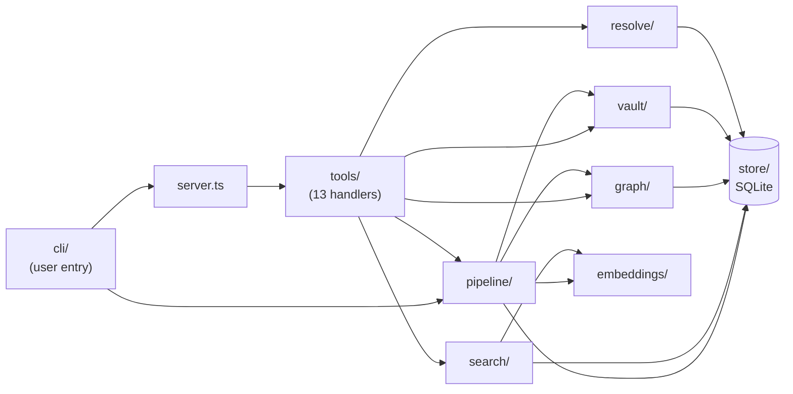
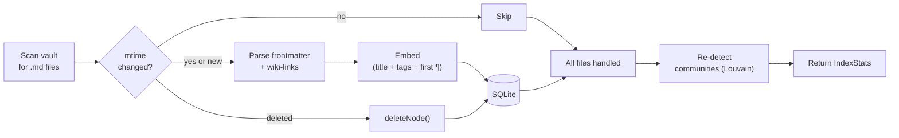

# obsidian-brain architecture

This document explains *why* obsidian-brain is built the way it is. The [Quick start](getting-started.md) and [Tool reference](tools.md) cover *what* it does; this covers the decisions behind the structure, what each one trades away, and when you might want to revisit it.

## Module layout at a glance

One-way-ish deps: everything flows toward `store/`. Tools never reach into `store/` directly — they go through `search/` / `graph/` / `vault/` / `resolve/` which own the query shapes. That boundary lets us swap any store implementation without touching tool handlers.

## How indexing actually runs

Incremental by default — only files whose `mtime` has changed go through parse + embed. That's why a re-index of a 10k-note vault with nothing changed costs roughly one `stat()` per file.

## Why stdio, not HTTP

The single most consequential decision. `src/server.ts:56` instantiates a `StdioServerTransport` and nothing else — there is no HTTP listener, no SSE endpoint, no port binding anywhere in the codebase.

Arguments for stdio:

- **No network listener, no network failure modes.** No firewall prompt, no port conflict with whatever else you're running, no auth scheme to implement (and get wrong). The only ambient authority is "whoever can exec our binary."
- **Process lifetime tracks the client.** The MCP host (Claude Desktop, Claude Code, Jan, etc.) spawns the server as a child. When the client exits, the server exits. There is no "I closed Obsidian but the server is still holding a port" failure class, and no orphaned daemons to reap.
- **Immune to a whole class of MCP transport bugs.** The most topical example is [modelcontextprotocol/rust-sdk#468](https://github.com/modelcontextprotocol/rust-sdk/issues/468): rmcp's Streamable-HTTP client mis-parses SSE frames emitted by TypeScript-SDK servers, so the first request works and every subsequent request fails with "Transport closed." That bug is what causes the aaronsb Obsidian MCP plugin to break when paired with Jan. See [Appendix: the rmcp / SSE bug](#appendix-the-rmcp--sse-bug-in-detail) below.

Tradeoff given up: you cannot run obsidian-brain on a remote host and connect to it over LAN. If you need that topology, wrap the stdio server in `mcp-proxy` or similar — the vault is local anyway, and the desktop MCP client is almost always on the same box, so this rarely bites in practice.

## Why SQLite with FTS5 + sqlite-vec

The index is a single `better-sqlite3` file that holds everything: graph nodes, edges, communities, full-text index, vector embeddings, and per-file sync state. No separate vector DB (LanceDB, Chroma, Qdrant), no separate search daemon (Meilisearch, Tantivy).

Reference points in the code:

- Schema: `src/store/db.ts:35` — `nodes`, `edges`, `communities`, `sync`, plus the FTS5 virtual table `nodes_fts` and the sqlite-vec virtual table `nodes_vec`. The vec0 dim is reconciled against the embedder at runtime via `ensureVecTable` (`src/store/db.ts:99`). Since v1.2.2 `deleteNode` also cascades to the `communities` table via `pruneNodeFromCommunities` (`src/store/communities.ts:32`), which filters the deleted id out of every community's `node_ids` array and removes rows that became empty.
- Vector kNN: `src/store/embeddings.ts:39` — `embedding MATCH ? AND k = ?` against `vec0`.
- Full-text: `src/store/fulltext.ts:27` — standard FTS5 `MATCH` with `snippet()` for excerpts.
- Sync state: `src/store/sync.ts` — tracks `(path, mtime, indexed_at)` for incremental re-index.

Why one file for all of it:

- **One data dir, one backup, one invariant.** If you `cp` the SQLite file, you've copied the entire index atomically. If you delete `DATA_DIR`, everything resets cleanly. There is no "the vector DB is ahead of the graph DB" drift to reason about.
- **Vault-relative path is the universal join key.** Every row everywhere uses the relative path (e.g. `Areas/Ideas/thought.md`) as its ID. Nodes, edges, embeddings, and sync all join on it. See `src/store/nodes.ts`, `src/store/edges.ts`, `src/store/embeddings.ts`.
- **better-sqlite3 is synchronous and fast.** For a single-vault, single-user workload there is no concurrent writer, so we skip connection pooling and async ceremony entirely. `src/store/db.ts:25` sets `journal_mode = WAL` for safe reads during writes and that is the whole concurrency story.

Tradeoff: sqlite-vec does a full scan for kNN. This is fine at the vault sizes we target (50k notes: subsecond on commodity hardware). Past roughly 500k notes you'd want an ANN index and this decision would need re-evaluation.

## Why local embeddings (Xenova all-MiniLM-L6-v2)

The default model is `Xenova/all-MiniLM-L6-v2` (`src/embeddings/embedder.ts:3`), overridable via `EMBEDDING_MODEL` (`src/embeddings/embedder.ts:21`), run locally via `@huggingface/transformers` with `dtype: 'q8'` quantization.

Why not an API like OpenAI's `text-embedding-3-small`:

- **Zero egress.** Vault content never leaves the machine. For people whose notes include journal entries, client names, medical notes, or anything else they'd rather not mail to an LLM vendor, this is the whole game.
- **No API key, no quota, no billing.** Important for a tool that re-embeds on every file save without anyone thinking about it.
- **~22 MB one-time model download**, then ~40 ms per note on CPU. Fast enough that the first full index of a 10k-note vault completes in minutes and incremental re-indexing is imperceptible.

Tradeoff: quality is measurably below modern API embeddings on hard semantic-similarity benchmarks. If this matters for your vault, the model is pluggable — the embedder reads `EMBEDDING_MODEL` from env (`src/embeddings/embedder.ts:21`), probes output dim on init, and reconciles against the stored vec0 table. Any transformers.js-compatible sentence-embedding model works. If the new model's output dim differs from the stored index, the server errors with an instruction to run `obsidian-brain index --drop` and reindex (`src/store/db.ts:99-120`). `Embedder.buildEmbeddingText` is deliberately simple (title + tags + first paragraph) so it works across model choices.

## Why incremental mtime sync

Incremental mtime-based sync is the foundation both the live watcher and the scheduled fallback share. `src/pipeline/indexer.ts:41` implements the full-vault pipeline: parse vault, diff against `sync` state, upsert the diff, re-run community detection if anything changed. Since v1.2.2, "anything changed" also counts deletions and an explicit `resolution` argument — before, a delete-only run or a resolution-change-with-no-mtime-change would silently skip community refresh and leave ghost node ids in the `communities` table.

Why mtime-keyed incrementality:

- **Incremental is cheap.** The indexer checks `stat.mtimeMs` against the stored mtime in `sync` (`src/pipeline/indexer.ts:159`); if the file hasn't changed it skips re-parsing and re-embedding entirely. A full re-scan of an already-indexed 10k-note vault costs roughly a `stat()` per file.
- **The per-file primitive is shared between live and batch.** `indexSingleNote` (`src/pipeline/indexer.ts:87`) is what the watcher calls per debounced change; `index()` loops it across the whole vault. Both read the same mtime state, so any path can be reindexed from either entry point without drift.
- **Robust to sleep/resume.** `systemd` with `Persistent=true` catches up on missed timer fires after the machine wakes; `launchd` with `StartInterval` does the equivalent on macOS. See `docs/launchd.md` and `docs/systemd.md` for the scheduled-fallback configs.
- **The fallback exists because watchers across macOS / Linux / iCloud-synced folders are a known rabbit hole.** FSEvents silently drops events under high churn, inotify watchers die on move/rename under some filesystems, and iCloud Drive materialises files lazily. If the watcher misses an event on your setup, disable it (`OBSIDIAN_BRAIN_NO_WATCH=1`) and run `obsidian-brain index` on a timer instead.

Default behaviour: the watcher keeps the index live as you edit. If you disable it or your vault lives somewhere it can't observe, the scheduled-index timer fills the gap. For an ad-hoc refresh after a big manual edit, call the `reindex` MCP tool from chat (`src/tools/reindex.ts`) or run `obsidian-brain index` directly.

## Live sync

The scheduled-index model above is still the fallback. The default, since v1.1, is a chokidar watcher spawned inside `obsidian-brain server`. See `src/pipeline/watcher.ts`. Chokidar uses the native platform API (FSEvents on macOS, inotify on Linux, ReadDirectoryChangesW on Windows), not polling, so idle CPU cost is effectively zero.

Each change event is keyed by path and fed through a per-file debounce (`src/pipeline/watcher.ts:DEFAULT_DEBOUNCE_MS`, 3000 ms). Obsidian writes files on a ~2s autosave cadence, often multiple times during a single editing burst; the debounce collapses those into a single reindex per pause. When the debounce fires we call `indexSingleNote` (`src/pipeline/indexer.ts:indexSingleNote`) — the same primitive the write tools use, so incremental and batch paths share one code path: parse frontmatter + inline Dataview fields + wiki-links, re-embed, upsert node + edges, mark the graph dirty.

Community detection is debounced separately on 60 s (`OBSIDIAN_BRAIN_COMMUNITY_DEBOUNCE_MS`). Louvain runs over the entire graph and dominates cost on large vaults, so we batch it across many individual file changes. Per-file reindex stays snappy; community labels lag by up to a minute, which is fine because `detect_themes` is a background-style tool nobody refreshes every second.

Flow in one line: Obsidian saves file → chokidar emits `change` → 3 s debounce → `indexSingleNote` parses, embeds, upserts node + edges → community flagged dirty → 60 s later Louvain re-runs.

When to disable (`OBSIDIAN_BRAIN_NO_WATCH=1`): vault on SMB/NFS/iCloud where FSEvents/inotify don't fire reliably; shared-tenancy machines where you'd rather pay CPU on a fixed schedule than at edit time; or you already run a dedicated `obsidian-brain index` job and don't want two sources of writes.

## Why modular file layout

Every source file under `src/` targets under 200 lines and has a single concern. The directory layout is:

- `src/server.ts` — MCP server bootstrap. Instantiates `McpServer`, wires `StdioServerTransport`, registers every tool, and starts the live watcher.
- `src/config.ts` / `src/context.ts` — env parsing and the shared `ServerContext` object (DB handle, embedder, vault path, pipeline, writer, search) passed to every tool.
- `src/cli/` — the `obsidian-brain` CLI entry point: `server`, `index`, `watch`, `search` subcommands.
- `src/store/` — SQLite schema and per-table CRUD (`db`, `nodes`, `edges`, `embeddings`, `fulltext`, `communities`, `sync`).
- `src/embeddings/` — the transformers.js Embedder wrapper. One file.
- `src/graph/` — graph construction (`builder`), centrality (`centrality`), Louvain community detection (`communities`), shortest paths (`pathfinding`), and the graphology-compat shim.
- `src/vault/` — reading, writing, parsing, and editing `.md` files on disk; wiki-link resolution; fuzzy filename matching.
- `src/search/` — unified semantic + full-text search surface.
- `src/resolve/` — fuzzy note-name resolution used by tools that accept human-typed note titles.
- `src/pipeline/` — the indexing orchestrator (`indexer.ts`) that stitches vault parsing, store writes, embedding, and community detection together; plus the chokidar watcher (`watcher.ts`) that drives `indexSingleNote` on debounced file-change events.
- `src/tools/` — one file per MCP tool. `register.ts` is the shared Zod/schema helper; everything else is a tool handler.

Why this shape:

- **The original obra `graph.ts` was 324 lines** mixing graph construction, pathfinding, centrality, and Louvain into one module. Every change required re-reading the whole file to make sure you hadn't broken something in an unrelated concern. Splitting it along the natural algorithm boundaries made each piece independently greppable, testable, and swappable.
- **Swap surface area is small and local.** You can replace `src/graph/centrality.ts` with an approximate-pagerank variant without touching anything else; you can replace `src/store/embeddings.ts` with a HNSW-backed implementation without touching the graph code. Tools never reach into stores directly except via the exported functions.
- **The tool layer is flat on purpose.** `src/tools/*.ts` is one-file-per-tool because it matches the MCP surface 1:1 — when a user asks "what does `find_connections` do?", you open exactly one file.

## Features that require a companion plugin

Three capabilities only exist **inside a running Obsidian process** — not in the on-disk vault:

- **Dataview DQL queries** — Dataview's index and query engine live in Obsidian's memory.
- **Obsidian Bases** — view rows are computed against Obsidian's metadata cache.
- **Live-workspace / active-editor awareness** — which note is open and the cursor position only exist in the UI.

For these we ship an **optional** [`obsidian-brain-plugin`](https://github.com/sweir1/obsidian-brain-plugin) that runs inside Obsidian and exposes a localhost-only HTTP endpoint with bearer-token auth. The standalone MCP server discovers the plugin via a vault-scoped discovery file at `{VAULT}/.obsidian/plugins/obsidian-brain-companion/discovery.json` and proxies the plugin-dependent tools through it. Currently: `active_note` (server v1.2.0 / plugin v0.1.0+) and `dataview_query` (server v1.3.0 / plugin v0.2.0+). `base_query` is planned for v1.4.0. When the plugin is absent or Obsidian isn't running, those tools surface an actionable install message; every other tool keeps working.

**Capability gating** (since v1.3.0): the plugin writes `capabilities: string[]` into `discovery.json` — v0.2.0 emits `["status", "active", "dataview"]`. `ObsidianClient.has(capability)` in `src/obsidian/client.ts` reads that list; capability-gated tools check before making the HTTP call and return a clean "upgrade to plugin vX.Y.Z" error when the installed plugin is too old, instead of opaque 404s from missing routes. Plugins without the `capabilities` field (v0.1.x) are treated as `["status", "active"]` for backward compatibility.

Why this shape (a plugin that's just a data provider, not an MCP server):

- **Keeps the MCP surface stdio-only.** Putting the MCP server inside the plugin, as [`aaronsb/obsidian-mcp-plugin`](https://github.com/aaronsb/obsidian-mcp-plugin) does, forces HTTP transport, which is what trips the rmcp SSE bug in Jan. Our stdio server sidesteps that entirely (see Appendix).
- **Keeps the "works without Obsidian" promise.** The standalone server and its 13 non-plugin-dependent tools are fully functional with Obsidian closed.
- **Plugin is a minimal data provider, not a full MCP implementation.** A few HTTP routes, ~5 KB of bundled code. The tool surface, auth, schema validation, and MCP protocol handling all live in the Node server where they already work.

**Cloud embeddings** (OpenAI / Voyage / Cohere) are the one item in the "doesn't do" table that won't land via the plugin. That's a deliberate stance — fully local, zero egress, works offline. The `Embedder` interface is forkable if anyone wants cloud embeddings as a personal variant.

## Appendix: the rmcp / SSE bug in detail

This is the bug hiding behind decision #1. Understanding it makes the stdio choice feel less arbitrary.

The shape of the bug:

- MCP's Streamable HTTP spec allows a POST /mcp response to return either `application/json` (one-shot) or `text/event-stream` (SSE). Servers choose.
- The TypeScript MCP SDK's `StreamableHTTPServerTransport` defaults to SSE, emitting one frame per response and then closing the stream.
- rmcp's (Rust) client reads the first frame correctly but mis-handles the stream close as a transport-level disconnect rather than a normal end-of-response. Every subsequent request then fails with "Transport closed."
- Fixed upstream in [rust-sdk PR #467](https://github.com/modelcontextprotocol/rust-sdk/pull/467), tracked in [rust-sdk#468](https://github.com/modelcontextprotocol/rust-sdk/issues/468). As of this writing the fix has not shipped in Jan 0.7.9, so any rmcp-client + TS-SDK-SSE-server pairing breaks. `docs/jan.md` covers the workaround when you hit it.

Why stdio sidesteps this entirely: there is no stream framing to disagree about. stdio MCP is line-delimited JSON-RPC over a pipe. The transport has essentially no surface area to get wrong. As a class of bug, "SSE framing interop" cannot exist here.

This is also the general argument for stdio over HTTP for local tools: the protocol surface you get with stdio is small enough that implementations tend to agree, and the failure modes when they don't are obvious (the pipe dies, the child exits) rather than subtle (request 2 silently times out).
