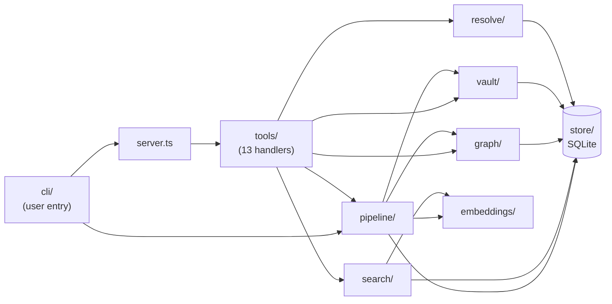
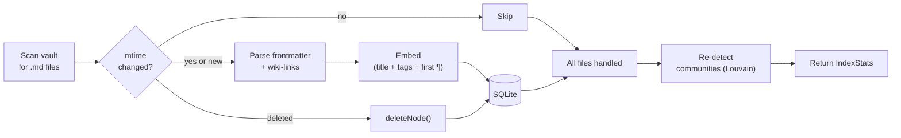

# obsidian-brain architecture

This document explains *why* obsidian-brain is built the way it is. The [README](../README.md) covers *what* it does; this covers the decisions behind the structure, what each one trades away, and when you might want to revisit it.

## Module layout at a glance

One-way-ish deps: everything flows toward `store/`. Tools never reach into `store/` directly — they go through `search/` / `graph/` / `vault/` / `resolve/` which own the query shapes. That boundary lets us swap any store implementation without touching tool handlers.

## How indexing actually runs

Incremental by default — only files whose `mtime` has changed go through parse + embed. That's why a re-index of a 10k-note vault with nothing changed costs roughly one `stat()` per file.

## Why stdio, not HTTP

The single most consequential decision. `src/server.ts:37` instantiates a `StdioServerTransport` and nothing else — there is no HTTP listener, no SSE endpoint, no port binding anywhere in the codebase.

Arguments for stdio:

- **No network listener, no network failure modes.** No firewall prompt, no port conflict with whatever else you're running, no auth scheme to implement (and get wrong). The only ambient authority is "whoever can exec our binary."
- **Process lifetime tracks the client.** The MCP host (Claude Desktop, Claude Code, Jan, etc.) spawns the server as a child. When the client exits, the server exits. There is no "I closed Obsidian but the server is still holding a port" failure class, and no orphaned daemons to reap.
- **Immune to a whole class of MCP transport bugs.** The most topical example is [modelcontextprotocol/rust-sdk#468](https://github.com/modelcontextprotocol/rust-sdk/issues/468): rmcp's Streamable-HTTP client mis-parses SSE frames emitted by TypeScript-SDK servers, so the first request works and every subsequent request fails with "Transport closed." That bug is what causes the aaronsb Obsidian MCP plugin to break when paired with Jan. See [Appendix: the rmcp / SSE bug](#appendix-the-rmcp--sse-bug-in-detail) below.

Tradeoff given up: you cannot run obsidian-brain on a remote host and connect to it over LAN. If you need that topology, wrap the stdio server in `mcp-proxy` or similar — the vault is local anyway, and the desktop MCP client is almost always on the same box, so this rarely bites in practice.

## Why SQLite with FTS5 + sqlite-vec

The index is a single `better-sqlite3` file that holds everything: graph nodes, edges, communities, full-text index, vector embeddings, and per-file sync state. No separate vector DB (LanceDB, Chroma, Qdrant), no separate search daemon (Meilisearch, Tantivy).

Reference points in the code:

- Schema: `src/store/db.ts:28` — `nodes`, `edges`, `communities`, `sync`, plus the FTS5 virtual table `nodes_fts` and the sqlite-vec virtual table `nodes_vec`.
- Vector kNN: `src/store/embeddings.ts:29` — `embedding MATCH ? AND k = ?` against `vec0`.
- Full-text: `src/store/fulltext.ts:16` — standard FTS5 `MATCH` with `snippet()` for excerpts.
- Sync state: `src/store/sync.ts` — tracks `(path, mtime, indexed_at)` for incremental re-index.

Why one file for all of it:

- **One data dir, one backup, one invariant.** If you `cp` the SQLite file, you've copied the entire index atomically. If you delete `DATA_DIR`, everything resets cleanly. There is no "the vector DB is ahead of the graph DB" drift to reason about.
- **Vault-relative path is the universal join key.** Every row everywhere uses the relative path (e.g. `Areas/Ideas/thought.md`) as its ID. Nodes, edges, embeddings, and sync all join on it. See `src/store/nodes.ts`, `src/store/edges.ts`, `src/store/embeddings.ts`.
- **better-sqlite3 is synchronous and fast.** For a single-vault, single-user workload there is no concurrent writer, so we skip connection pooling and async ceremony entirely. `src/store/db.ts:18` sets `journal_mode = WAL` for safe reads during writes and that is the whole concurrency story.

Tradeoff: sqlite-vec does a full scan for kNN. This is fine at the vault sizes we target (50k notes: subsecond on commodity hardware). Past roughly 500k notes you'd want an ANN index and this decision would need re-evaluation.

## Why local embeddings (Xenova all-MiniLM-L6-v2)

`src/embeddings/embedder.ts:3` hardcodes `Xenova/all-MiniLM-L6-v2` as the default, run locally via `@huggingface/transformers` with `dtype: 'q8'` quantization.

Why not an API like OpenAI's `text-embedding-3-small`:

- **Zero egress.** Vault content never leaves the machine. For people whose notes include journal entries, client names, medical notes, or anything else they'd rather not mail to an LLM vendor, this is the whole game.
- **No API key, no quota, no billing.** Important for a tool that wants to re-embed a subset of the vault every 30 minutes without anyone thinking about it.
- **~22 MB one-time model download**, then ~40 ms per note on CPU. Fast enough that the first full index of a 10k-note vault completes in minutes and incremental re-indexing is imperceptible.

Tradeoff: quality is measurably below modern API embeddings on hard semantic-similarity benchmarks. If this matters for your vault, the model is pluggable — `src/config.ts` reads `EMBEDDING_MODEL` from env, and any transformers.js-compatible sentence-embedding model that produces a single 384-dim (or differently-dim'd, if you also update the schema) vector will work. `Embedder.buildEmbeddingText` at `src/embeddings/embedder.ts:41` is deliberately simple (title + tags + first paragraph) so it works across model choices.

## Why incremental mtime sync

There is no file watcher and no long-running daemon. Indexing is a periodic CLI run. `src/pipeline/indexer.ts:32` implements the full pipeline: parse vault, diff against `sync` state, upsert the diff, re-run community detection if anything changed.

Why periodic over watched:

- **File watchers across macOS / Linux / iCloud-synced folders are a known rabbit hole.** `fsevents` silently drops events under high churn, inotify watchers die on move/rename under some filesystems, and iCloud Drive materializes files lazily so you get notifications for paths that are not actually readable yet. Every "just watch the folder" approach eventually has to add a periodic rescan anyway for correctness.
- **A periodic re-index is boring, correct, and robust to sleep/resume.** `systemd` with `Persistent=true` catches up on missed timer fires after the machine wakes; `launchd` with `StartInterval` does the equivalent on macOS. See `docs/launchd.md` and `docs/systemd.md` for the working configs.
- **Incremental is cheap.** The indexer checks `stat.mtimeMs` against the stored mtime in `sync` (`src/pipeline/indexer.ts:54`); if the file hasn't changed it skips re-parsing and re-embedding entirely. A full re-scan of an already-indexed 10k-note vault costs roughly a `stat()` per file.

Tradeoff: the index lags real edits by up to the timer interval (default 30 min). For immediate freshness after a big manual edit, call the `reindex` MCP tool from chat (`src/tools/reindex.ts`) or run `obsidian-brain index` directly (or `node dist/cli/index.js index` from a local source clone).

## Why modular file layout

Every source file under `src/` targets under 200 lines and has a single concern. The directory layout is:

- `src/server.ts` — MCP server bootstrap. Instantiates `McpServer`, wires `StdioServerTransport`, registers every tool.
- `src/config.ts` / `src/context.ts` — env parsing and the shared `Context` object (DB handle, embedder, vault path) passed to every tool.
- `src/cli/` — the `obsidian-brain` CLI entry point for scheduled re-indexing.
- `src/store/` — SQLite schema and per-table CRUD (`db`, `nodes`, `edges`, `embeddings`, `fulltext`, `communities`, `sync`).
- `src/embeddings/` — the transformers.js Embedder wrapper. One file.
- `src/graph/` — graph construction (`builder`), centrality (`centrality`), Louvain community detection (`communities`), shortest paths (`pathfinding`), and the graphology-compat shim.
- `src/vault/` — reading, writing, parsing, and editing `.md` files on disk; wiki-link resolution; fuzzy filename matching.
- `src/search/` — unified semantic + full-text search surface.
- `src/resolve/` — fuzzy note-name resolution used by tools that accept human-typed note titles.
- `src/pipeline/` — the indexing orchestrator (`indexer.ts`) that stitches vault parsing, store writes, embedding, and community detection together.
- `src/tools/` — one file per MCP tool. `register.ts` is the shared Zod/schema helper; everything else is a tool handler.

Why this shape:

- **The original obra `graph.ts` was 324 lines** mixing graph construction, pathfinding, centrality, and Louvain into one module. Every change required re-reading the whole file to make sure you hadn't broken something in an unrelated concern. Splitting it along the natural algorithm boundaries made each piece independently greppable, testable, and swappable.
- **Swap surface area is small and local.** You can replace `src/graph/centrality.ts` with an approximate-pagerank variant without touching anything else; you can replace `src/store/embeddings.ts` with a HNSW-backed implementation without touching the graph code. Tools never reach into stores directly except via the exported functions.
- **The tool layer is flat on purpose.** `src/tools/*.ts` is one-file-per-tool because it matches the MCP surface 1:1 — when a user asks "what does `find_connections` do?", you open exactly one file.

## Why we dropped the aaronsb-plugin features

obsidian-brain deliberately does not implement:

- Dataview query execution
- Obsidian Bases
- Live-workspace / active-editor awareness
- File watching / real-time indexing
- Hybrid or cloud embeddings

All of those except the last require Obsidian to be running with specific plugins loaded — they are features of Obsidian's runtime, not features of the vault on disk. obsidian-brain's whole premise is that you don't need Obsidian running. Adding these would force us to either (a) require the Obsidian API, which reintroduces the "plugin half dies when Obsidian closes" problem we're trying to avoid, or (b) reimplement Dataview etc. from scratch, which is a multi-year project.

If you need those features, run the [aaronsb/obsidian-mcp-plugin](https://github.com/aaronsb/obsidian-mcp-plugin) alongside obsidian-brain. They're complementary — stdio transport vs. HTTP transport, different tool names, no conflict.

## Appendix: the rmcp / SSE bug in detail

This is the bug hiding behind decision #1. Understanding it makes the stdio choice feel less arbitrary.

The shape of the bug:

- MCP's Streamable HTTP spec allows a POST /mcp response to return either `application/json` (one-shot) or `text/event-stream` (SSE). Servers choose.
- The TypeScript MCP SDK's `StreamableHTTPServerTransport` defaults to SSE, emitting one frame per response and then closing the stream.
- rmcp's (Rust) client reads the first frame correctly but mis-handles the stream close as a transport-level disconnect rather than a normal end-of-response. Every subsequent request then fails with "Transport closed."
- Fixed upstream in [rust-sdk PR #467](https://github.com/modelcontextprotocol/rust-sdk/pull/467), tracked in [rust-sdk#468](https://github.com/modelcontextprotocol/rust-sdk/issues/468). As of this writing the fix has not shipped in Jan 0.7.9, so any rmcp-client + TS-SDK-SSE-server pairing breaks. `docs/jan.md` covers the workaround when you hit it.

Why stdio sidesteps this entirely: there is no stream framing to disagree about. stdio MCP is line-delimited JSON-RPC over a pipe. The transport has essentially no surface area to get wrong. As a class of bug, "SSE framing interop" cannot exist here.

This is also the general argument for stdio over HTTP for local tools: the protocol surface you get with stdio is small enough that implementations tend to agree, and the failure modes when they don't are obvious (the pipe dies, the child exits) rather than subtle (request 2 silently times out).
